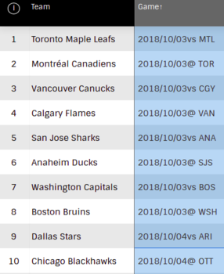

<a href="https://colab.research.google.com/github/maddran/NHL-pred/blob/main/NHL_games_data.ipynb" target="_parent"></a>


Having been a long suffering fan of my hometown hockey team (Go Flames Go!), I have had some version of a hockey score / performance prediction project on the go for many, many years. In fact, when I was first self-learning programming in Python, these kinds of projects were key in helping me solidify my skills in data gathering, cleaning, and exploratory analysis.

In this series, I will implement a few different game score/margin prediction pipelines from end-to-end. Part 1 focuses on calling the NHL Stats API to download game-level regular season data for five seasons from 2014-2019, and applying some pre-processing.<br><br>

---

##Module Imports


```
import requests
import pandas as pd
from pandas import json_normalize 
from datetime import datetime
from time import sleep
```

## Function Definitions

Let's get cracking with some function definitions. I'm going to provide a brief overview of the function in text (in lieu of a docstring). I'll also pepper in some comments within the code where I feel it's useful.

### Call NHL API

**Avoid Scraping Raw HTML -**
If you're not familiar with web development, your first instinct when trying to scrape data from a table such as [this one on NHL Stats](http://www.nhl.com/stats/teams), might be to try to download the data directly as you see it rendered in your browser. While there are plently of Python modules that will allow you to do this relatively easily, it is not the most robust approach as there is a good chance your implementation will break once the site undergoes an update which changes its layout.

**Identify Data API -** The better approach is to try to identify the API call which produces the data that is being displayed. To do this, use your browser's developer tools to inspect the network traffic as you load the page which contains your data ([Chrome demo](https://developers.google.com/web/tools/chrome-devtools/network)). With a bit of experience, spotting these data APIs becomes quite easy. But, when you're starting off, expect there to be some trial and error.

**Replicate API call in Python -** If you are lucky enough to spot a data API, you can replicate it in Python code by:


1.   Right clicking on the API call in your browser's developer tools
2.   Select Copy > Copy as cURL
3.   Navigate to [this handy utility](https://curl.trillworks.com/) (or something similar) and paste in the copied cURL command to generate the corresponding Python `requests` code.

The generated Python code can now be used with the Python `requests` module as in the function.  `call_nhl` is a function that:

*   takes mandatory input `startSeason` and optional input `endSeason`, each of which are strings in the format `20xx20yy` where `yy = xx + 1` (e.g. `20142015`, `20152016`, etc.)
*   outputs `response`, the JSON response from the API.


```
def call_nhl(startSeason, endSeason=None):

  # Possible to call API for multiple seasons, 
  # but if no end season is provided, set end season = start season.
  if not endSeason:
    endSeason = startSeason

  # Headers in the API call authenticate the requests
  headers = {
      'authority': 'api.nhle.com',
      # Could cycle through different user agents using the fake-useragent module 
      # if the API appears to be blocking repeated calls
      'user-agent': 'Mozilla/5.0 (X11; Linux x86_64) AppleWebKit/537.36 (KHTML, like Gecko) Chrome/87.0.4280.141 Safari/537.36',
      'accept': '*/*',
      'origin': 'http://www.nhl.com',
      'sec-fetch-site': 'cross-site',
      'sec-fetch-mode': 'cors',
      'sec-fetch-dest': 'empty',
      'referer': 'http://www.nhl.com/',
      'accept-language': 'en-US,en;q=0.9',
  }

  params = (
      ('isAggregate', 'false'),
      ('isGame', 'true'),
      ('sort', '[{"property":"gameDate","direction":"DESC"}]'),
      ('start', '0'),
      # Setting limit = 0 returns all games for given season
      ('limit', '0'),
      ('factCayenneExp', 'gamesPlayed>=1'),
      # Through trial and error, gameTypeId=2 corresponds to regular season games
      # The f-string inserts endSeason and startSeason into the parameters
      ('cayenneExp', f'gameTypeId=2 and seasonId<={endSeason} and seasonId>={startSeason}'),
  )
  
  # Call API with given headers and parameters
  response = requests.get('https://api.nhle.com/stats/rest/en/team/summary', headers=headers, params=params)

  return response
```

### Get Game Data

A previous version of the NHL API could only return a limited number of results, and would time out if too much data was requested. Although this no longer seems to be an issue (at least in the context of retrieving 5 seasons of game summaries) I will make individual calls to `call_nhl` for each season.

`get_gameData` is a function that:

*   Takes integer inputs `startYear` (year in `YYYY` format) and `numSeasons`
*   Returns a dictionary of `season ID : game data` pairs for `numSeasons` seasons starting with the season that began in `startYear`.


```
def get_gameData(startYear, numSeasons):

  seasons = [f"{startYear+i}{startYear+i+1}" for i in range(numSeasons)]

  rows=0
  res = {}

  for s in seasons:
    response = call_nhl(s)

    # Try except is probably more appropriate,
    # but if it ain't broke...
    if response:
      response = response.json()
      rows+=len(response['data'])
      df = pd.json_normalize(response['data'])
      res[s] = df
      print(f"Number of games grabbed for {s} = {len(response['data'])}. Total = {rows}")
    else:
      print("ERROR: unable to connect to NHL API")
      return None

  return res
```

## What do we have so far?

Lets's call `get_gameData` for a single year and see what the result looks like:


```
data = get_gameData(2018, 1)

print("\nSummary of 2018-19 season game data:\n")
# pandas describe function provides an easy way of viewing  
# a summary of a dataframe.
df = list(data.values())[0]
df.columns
```

    Number of games grabbed for 20182019 = 2542. Total = 2542
    
    Summary of 2018-19 season game data:
    


    Index(['faceoffWinPct', 'gameDate', 'gameId', 'gamesPlayed', 'goalsAgainst',
           'goalsAgainstPerGame', 'goalsFor', 'goalsForPerGame', 'homeRoad',
           'losses', 'opponentTeamAbbrev', 'otLosses', 'penaltyKillNetPct',
           'penaltyKillPct', 'pointPct', 'points', 'powerPlayNetPct',
           'powerPlayPct', 'regulationAndOtWins', 'shotsAgainstPerGame',
           'shotsForPerGame', 'teamFullName', 'teamId', 'ties', 'wins',
           'winsInRegulation', 'winsInShootout'],
          dtype='object')


In 2018, the NHL had 31 teams each of whom played 82 games for `31 x 82 = 2542` total games. So, our result looks good!

## More Function Definitions

Great! So, we have a means of collecting game data. Now, to help with analysis and prediction down the road, I'd like to extract a schedule of games as well as a rolling window aggregate from the raw dataset for each season.  


### Get Game schedule

To start, we need to produce a means of looking up a team's name by their ID. There is another endpoint on the NHL API that provides this, but since we have our season of data loaded already, let's just use that.

`get_teamLU` takes a pandas dataframe containing a game summaries as input and produces a dictionary of `team ID : team name` pairs.


```
def get_teamLU(df):
  return dict(zip(df['teamId'], df['teamFullName']))
```

For the 2018-19 data, that produces:


```
teamLU = get_teamLU(df)
teamLU
```


    {1: 'New Jersey Devils',
     2: 'New York Islanders',
     3: 'New York Rangers',
     4: 'Philadelphia Flyers',
     5: 'Pittsburgh Penguins',
     6: 'Boston Bruins',
     7: 'Buffalo Sabres',
     8: 'Montréal Canadiens',
     9: 'Ottawa Senators',
     10: 'Toronto Maple Leafs',
     12: 'Carolina Hurricanes',
     13: 'Florida Panthers',
     14: 'Tampa Bay Lightning',
     15: 'Washington Capitals',
     16: 'Chicago Blackhawks',
     17: 'Detroit Red Wings',
     18: 'Nashville Predators',
     19: 'St. Louis Blues',
     20: 'Calgary Flames',
     21: 'Colorado Avalanche',
     22: 'Edmonton Oilers',
     23: 'Vancouver Canucks',
     24: 'Anaheim Ducks',
     25: 'Dallas Stars',
     26: 'Los Angeles Kings',
     28: 'San Jose Sharks',
     29: 'Columbus Blue Jackets',
     30: 'Minnesota Wild',
     52: 'Winnipeg Jets',
     53: 'Arizona Coyotes',
     54: 'Vegas Golden Knights'}


Now, we define a function `home_road` which takes a game summary dataframe and the team lookup dictionary `team_LU` to produce four new columns:

*   `home, road` - contain hoame and road team IDs, respectively
*   `homeName, roadName` - contain hoame and road team names, respectively

The funciton `get_schedule` puts it all together by applying `home_road` to each entry in the game summary dataframe `df` and then groups it by the `gameId` and `gameDate` columns to produce the final schedule:


```
def home_road(df, teamLU):
  res = {}
  res['home'] = df[df['homeRoad']=='H']['teamId'].values[0]
  res['road'] = df[df['homeRoad']=='R']['teamId'].values[0]

  res['homeName'] = teamLU[res['home']]
  res['roadName'] = teamLU[res['road']]

  return pd.Series(res, index=res.keys())

def get_schedule(df, teamLU):
  return df.groupby(['gameId', 'gameDate']).apply(home_road, teamLU)
```

Let's see what the schedule looks like for the 2018-19 season:


```
get_schedule(df, teamLU).head()
```


<div>
<style scoped>
    .dataframe tbody tr th:only-of-type {
        vertical-align: middle;
    }

    .dataframe tbody tr th {
        vertical-align: top;
    }

    .dataframe thead th {
        text-align: right;
    }
</style>
<table border="1" class="dataframe">
  <thead>
    <tr style="text-align: right;">
      <th></th>
      <th></th>
      <th>home</th>
      <th>road</th>
      <th>homeName</th>
      <th>roadName</th>
    </tr>
    <tr>
      <th>gameId</th>
      <th>gameDate</th>
      <th></th>
      <th></th>
      <th></th>
      <th></th>
    </tr>
  </thead>
  <tbody>
    <tr>
      <th>2018020001</th>
      <th>2018-10-03</th>
      <td>10</td>
      <td>8</td>
      <td>Toronto Maple Leafs</td>
      <td>Montréal Canadiens</td>
    </tr>
    <tr>
      <th>2018020002</th>
      <th>2018-10-03</th>
      <td>15</td>
      <td>6</td>
      <td>Washington Capitals</td>
      <td>Boston Bruins</td>
    </tr>
    <tr>
      <th>2018020003</th>
      <th>2018-10-03</th>
      <td>23</td>
      <td>20</td>
      <td>Vancouver Canucks</td>
      <td>Calgary Flames</td>
    </tr>
    <tr>
      <th>2018020004</th>
      <th>2018-10-03</th>
      <td>28</td>
      <td>24</td>
      <td>San Jose Sharks</td>
      <td>Anaheim Ducks</td>
    </tr>
    <tr>
      <th>2018020005</th>
      <th>2018-10-04</th>
      <td>7</td>
      <td>6</td>
      <td>Buffalo Sabres</td>
      <td>Boston Bruins</td>
    </tr>
  </tbody>
</table>
</div>
 

<br>This appears to match the table from NHL Stats. Yay!<br>

> 


### Rolling Aggregate

One hypothesis I'd like to test is that performance in the recent past (3-7 games) is far more indicative of future performance than games in the far past. So, let's write a funciton that produces a rolling aggregate of some of columns in the game summary.

`rolling_aggregate` takes a dataframe of game summaries and an integer `window` representing the window of games to consider in each aggregation:


*   for certain data columns such as `'gamesPlayed', 'goalsAgainst', 'goalsFor', 'points', 'regulationAndOtWins'` etc., the aggreagtion should be a sum
*   for columns such as `'goalsForPerGame', 'goalsAgainstPerGame'` etc., the aggregation should be a mean
*   certain others can also be summed cumulatively

`get_rolling` applies `rolling_aggregate` to the grouped game summaries of each team to produces an aggregated dataset.


```
def rolling_aggregate(df, window = 3):
  res = {}
  roll_sum = ['gamesPlayed', 'goalsAgainst', 'goalsFor', 
              'losses', 'otLosses', 
              'points', 
              'regulationAndOtWins', 'winsInShootout']

  roll_mean = ['goalsForPerGame', 'goalsAgainstPerGame',
               'shotsForPerGame', 'shotsAgainstPerGame']

  cumsum = ['gamesPlayed', 'points', 
            'goalsFor', 'goalsAgainst']
            
  # fill and NaNs with 0
  df = df.fillna(0)

  # aggregate by sum
  res = df[roll_sum].rolling(window).sum()
  # aggregate by mean
  res = res.merge(df[roll_mean].rolling(window).mean(), 
            left_index=True, right_index = True)
  res.columns = [f"rolling_{col}" for col in res.columns]
  res['rolling_pointsPct'] = res['rolling_points']/(window*2)
  # cumulative sum
  res[[f"cum_{col}" for col in cumsum]] = df[cumsum].cumsum()

  res.index = df['gameId']

  res = res[sorted(res.columns)]

  return res

def get_rolling(df, window=3):
  return df.groupby(['teamId']).apply(rolling_aggregate, window)

```

For the 2018-19 data and a game window of 7 games, `get_rolling` gives the following result:


```
get_rolling(df,3).head(10)
```


<div>
<style scoped>
    .dataframe tbody tr th:only-of-type {
        vertical-align: middle;
    }

    .dataframe tbody tr th {
        vertical-align: top;
    }

    .dataframe thead th {
        text-align: right;
    }
</style>
<table border="1" class="dataframe">
  <thead>
    <tr style="text-align: right;">
      <th></th>
      <th></th>
      <th>cum_gamesPlayed</th>
      <th>cum_goalsAgainst</th>
      <th>cum_goalsFor</th>
      <th>cum_points</th>
      <th>rolling_gamesPlayed</th>
      <th>rolling_goalsAgainst</th>
      <th>rolling_goalsAgainstPerGame</th>
      <th>rolling_goalsFor</th>
      <th>rolling_goalsForPerGame</th>
      <th>rolling_losses</th>
      <th>rolling_otLosses</th>
      <th>rolling_points</th>
      <th>rolling_pointsPct</th>
      <th>rolling_regulationAndOtWins</th>
      <th>rolling_shotsAgainstPerGame</th>
      <th>rolling_shotsForPerGame</th>
      <th>rolling_winsInShootout</th>
    </tr>
    <tr>
      <th>teamId</th>
      <th>gameId</th>
      <th></th>
      <th></th>
      <th></th>
      <th></th>
      <th></th>
      <th></th>
      <th></th>
      <th></th>
      <th></th>
      <th></th>
      <th></th>
      <th></th>
      <th></th>
      <th></th>
      <th></th>
      <th></th>
      <th></th>
    </tr>
  </thead>
  <tbody>
    <tr>
      <th rowspan="10" valign="top">1</th>
      <th>2018021262</th>
      <td>1</td>
      <td>3</td>
      <td>4</td>
      <td>2</td>
      <td>NaN</td>
      <td>NaN</td>
      <td>NaN</td>
      <td>NaN</td>
      <td>NaN</td>
      <td>NaN</td>
      <td>NaN</td>
      <td>NaN</td>
      <td>NaN</td>
      <td>NaN</td>
      <td>NaN</td>
      <td>NaN</td>
      <td>NaN</td>
    </tr>
    <tr>
      <th>2018021247</th>
      <td>2</td>
      <td>6</td>
      <td>5</td>
      <td>2</td>
      <td>NaN</td>
      <td>NaN</td>
      <td>NaN</td>
      <td>NaN</td>
      <td>NaN</td>
      <td>NaN</td>
      <td>NaN</td>
      <td>NaN</td>
      <td>NaN</td>
      <td>NaN</td>
      <td>NaN</td>
      <td>NaN</td>
      <td>NaN</td>
    </tr>
    <tr>
      <th>2018021222</th>
      <td>3</td>
      <td>8</td>
      <td>9</td>
      <td>4</td>
      <td>3.0</td>
      <td>8.0</td>
      <td>2.666667</td>
      <td>9.0</td>
      <td>3.000000</td>
      <td>1.0</td>
      <td>0.0</td>
      <td>4.0</td>
      <td>0.666667</td>
      <td>2.0</td>
      <td>32.333333</td>
      <td>35.000000</td>
      <td>0.0</td>
    </tr>
    <tr>
      <th>2018021207</th>
      <td>4</td>
      <td>11</td>
      <td>11</td>
      <td>5</td>
      <td>3.0</td>
      <td>8.0</td>
      <td>2.666667</td>
      <td>7.0</td>
      <td>2.333333</td>
      <td>1.0</td>
      <td>1.0</td>
      <td>3.0</td>
      <td>0.500000</td>
      <td>1.0</td>
      <td>28.000000</td>
      <td>35.000000</td>
      <td>0.0</td>
    </tr>
    <tr>
      <th>2018021199</th>
      <td>5</td>
      <td>15</td>
      <td>11</td>
      <td>5</td>
      <td>3.0</td>
      <td>9.0</td>
      <td>3.000000</td>
      <td>6.0</td>
      <td>2.000000</td>
      <td>1.0</td>
      <td>1.0</td>
      <td>3.0</td>
      <td>0.500000</td>
      <td>1.0</td>
      <td>30.666667</td>
      <td>32.000000</td>
      <td>0.0</td>
    </tr>
    <tr>
      <th>2018021170</th>
      <td>6</td>
      <td>16</td>
      <td>14</td>
      <td>7</td>
      <td>3.0</td>
      <td>8.0</td>
      <td>2.666667</td>
      <td>5.0</td>
      <td>1.666667</td>
      <td>1.0</td>
      <td>1.0</td>
      <td>3.0</td>
      <td>0.500000</td>
      <td>1.0</td>
      <td>35.333333</td>
      <td>25.333333</td>
      <td>0.0</td>
    </tr>
    <tr>
      <th>2018021150</th>
      <td>7</td>
      <td>17</td>
      <td>15</td>
      <td>9</td>
      <td>3.0</td>
      <td>6.0</td>
      <td>2.000000</td>
      <td>4.0</td>
      <td>1.333333</td>
      <td>1.0</td>
      <td>0.0</td>
      <td>4.0</td>
      <td>0.666667</td>
      <td>1.0</td>
      <td>34.333333</td>
      <td>27.000000</td>
      <td>1.0</td>
    </tr>
    <tr>
      <th>2018021137</th>
      <td>8</td>
      <td>22</td>
      <td>16</td>
      <td>9</td>
      <td>3.0</td>
      <td>7.0</td>
      <td>2.333333</td>
      <td>5.0</td>
      <td>1.666667</td>
      <td>1.0</td>
      <td>0.0</td>
      <td>4.0</td>
      <td>0.666667</td>
      <td>1.0</td>
      <td>32.333333</td>
      <td>25.000000</td>
      <td>1.0</td>
    </tr>
    <tr>
      <th>2018021122</th>
      <td>9</td>
      <td>26</td>
      <td>17</td>
      <td>9</td>
      <td>3.0</td>
      <td>10.0</td>
      <td>3.333333</td>
      <td>3.0</td>
      <td>1.000000</td>
      <td>2.0</td>
      <td>0.0</td>
      <td>2.0</td>
      <td>0.333333</td>
      <td>0.0</td>
      <td>24.333333</td>
      <td>25.000000</td>
      <td>1.0</td>
    </tr>
    <tr>
      <th>2018021111</th>
      <td>10</td>
      <td>29</td>
      <td>17</td>
      <td>9</td>
      <td>3.0</td>
      <td>12.0</td>
      <td>4.000000</td>
      <td>2.0</td>
      <td>0.666667</td>
      <td>3.0</td>
      <td>0.0</td>
      <td>0.0</td>
      <td>0.000000</td>
      <td>0.0</td>
      <td>27.666667</td>
      <td>21.666667</td>
      <td>0.0</td>
    </tr>
  </tbody>
</table>
</div>


## Putting it all together

Let's wrap all the functions we defined into a single function we can all on mutiple seasons of game summary data.

`process_data` takes a dicttionary of game summary dataframes produced by `get_gameData` and outputs a dictionary containing the following:


*   raw dataframe, 
*   team lookup, 
*   game schedule, 
*   rolling aggregate dataframe

for each of the seasons being analysed.


```
def process_data(raw_data, window=3):
  data = {}
  for season, df in raw_data.items():
    df['gameDate'] = pd.to_datetime(df['gameDate'])
    df['seasonId'] = str(season)
    df = df.sort_values('gameDate', axis=0).reset_index(drop=True)

    teamLU = get_teamLU(df)

    schedule =  get_schedule(df, teamLU) 

    rolling = get_rolling(df,window)

    data[season] =  {'raw_data':df, 
                     'teamLU' : teamLU,
                     'schedule':schedule,
                     'rolling':rolling, 
                    }

  return data
```

### Getting data for 5 NHL seasons

So, let's get all the data we'll use in the prediction task. I'm going with the 5 most recent complete NHL seasons that were played - i.e. excluding the Covid-shortened seasons of 2019-20 and 2021.


```
# Get raw data
raw_data = get_gameData(2014, 5)

# Process data
data = process_data(raw_data)
```

    Number of games grabbed for 20142015 = 2460. Total = 2460
    Number of games grabbed for 20152016 = 2460. Total = 4920
    Number of games grabbed for 20162017 = 2460. Total = 7380
    Number of games grabbed for 20172018 = 2542. Total = 9922
    Number of games grabbed for 20182019 = 2542. Total = 12464


Great! So we have around 12k instances to complete the prediction task.

Here's a quick function to print the structure of the resulting object `data`.


```
def pretty(d, indent=0):
   for key, value in d.items():
      print('\t' * indent + str(key))
      if isinstance(value, dict):
        if key == "teamLU":
          print('\t' * (indent+1) + f"Dictionary: {len(value)}")
        else:
          pretty(value, indent+1)
      elif isinstance(value, pd.DataFrame):
         print('\t' * (indent+1) + f"DataFrame: {value.shape}")
      

pretty(data)
```

    20142015
    	raw_data
    		DataFrame: (2460, 28)
    	teamLU
    		Dictionary: 30
    	schedule
    		DataFrame: (1230, 4)
    	rolling
    		DataFrame: (2460, 17)
    20152016
    	raw_data
    		DataFrame: (2460, 28)
    	teamLU
    		Dictionary: 30
    	schedule
    		DataFrame: (1230, 4)
    	rolling
    		DataFrame: (2460, 17)
    20162017
    	raw_data
    		DataFrame: (2460, 28)
    	teamLU
    		Dictionary: 30
    	schedule
    		DataFrame: (1230, 4)
    	rolling
    		DataFrame: (2460, 17)
    20172018
    	raw_data
    		DataFrame: (2542, 28)
    	teamLU
    		Dictionary: 31
    	schedule
    		DataFrame: (1271, 4)
    	rolling
    		DataFrame: (2542, 17)
    20182019
    	raw_data
    		DataFrame: (2542, 28)
    	teamLU
    		Dictionary: 31
    	schedule
    		DataFrame: (1271, 4)
    	rolling
    		DataFrame: (2542, 17)


The above passes a sense check:

*   `teamLU` has 30 teams until 2017-18 which was the inaugural season of the Vegas Golden Knights (and what an inauguration that was!).
*   `raw_data` and `rolling` always have `82 games x N teams = 82N` entries
*   `schedule` always has `82N/2` entries.

Now that we are statisfied with the accuracy of the data, let's serialize it and save it for later - i.e. Part 2!


```
import pickle

pickle.dump( data, open( "data.p", "wb" ) )
```
